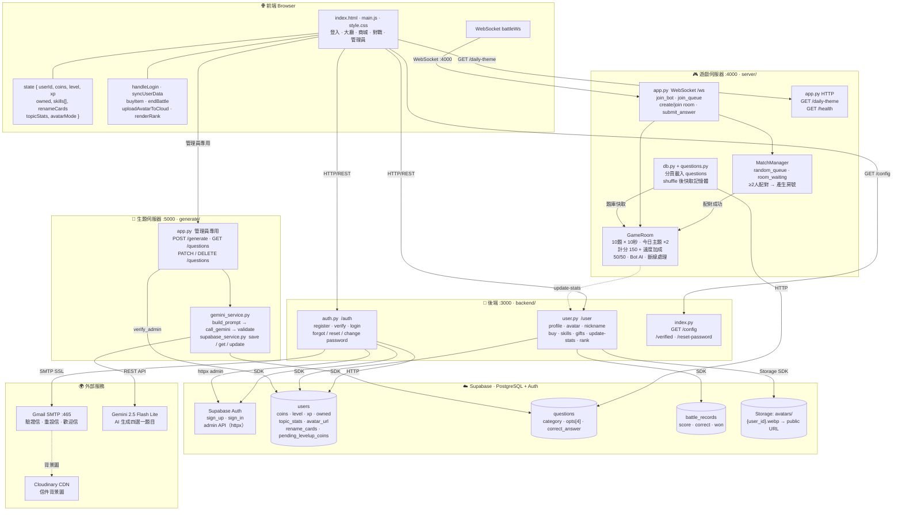

# 🧠 知識王 - Quiz King

## 📋 遊戲介紹

**知識王** 是一款在線實時知識競答遊戲，玩家透過登錄帳戶參與激烈的一對一對戰。遊戲包含 20+ 個知識主題，如科學、歷史、地理、電競、美食等，每場對戰 10 道題目。

**核心特色：**
- 🎮 **實時對戰**：WebSocket 實現毫秒級同步，兩名玩家同時作答
- 💰 **成長系統**：透過勝負獲得金幣、經驗值、升級等級
- 🎁 **禮包系統**：初次登入禮包、每日登入禮包、升等禮包（Popup 顯示前即入帳）
- 🛍️ **裝扮系統**：解鎖頭像框、稱號、特效等獎勵
- 🤖 **AI 練習**：可與 AI 對手進行練習
- 📊 **數據統計**：追蹤勝率、準確率、各主題成績、最強主題
- 🏆 **排行榜**：改名或對戰結束後自動刷新
- 🎯 **對戰技能**：使用「50/50 消去錯誤選項」、「加時 +10 秒」等技能（庫存制，每次使用消耗一個）

---

## 📁 檔案結構與功能說明

### 🎨 **前端部分（Frontend）**

#### `index.html` - 主頁面
```
功能：定義遊戲的 HTML 結構
主要元素：
- 登入／註冊／忘記密碼介面
- 遊戲大廳（個人數據、排行榜、商城）
- 遊戲對戰介面（題目顯示、選項、計時器、技能按鈕）
- 結算介面（勝負統計、獲得獎勵）
- 個人設定（外觀裝備、帳號管理）
- 禮包 Popup（歡迎禮包、每日禮包、升等禮包）
```

#### `main.js` - 客戶端邏輯與業務流程（核心檔案）
```
核心變數：
- state：玩家狀態
  * userId, playerName, customId, email
  * coins, level, xp, xpMax
  * wins, losses, totalAnswered, avgAccuracy, totalScore
  * owned: { frames, tags, effects, skills }
    - skills 為 text[]，允許重複（['skill-5050','skill-5050'] = 2 個）
  * renameCards：改名卡張數（整數）
  * topicStats：各主題答題統計 { category: { correct, wrong } }
  * nicknameRemainingFree：本月剩餘免費改名次數
  * avatarMode：'emoji' | 'image'（目前使用的頭像類型）
  * customAvatarDataUrl：自訂頭像的 URL 或 base64（image 模式）

- shopData：商城數據（頭像框、稱號、特效、技能、道具價格）

關鍵函數：
- handleLogin()：處理玩家登入
- handleRegister()：處理玩家註冊
- showScreen(id)：切換介面
- handleRandomMatch()：加入隨機配對佇列
- submitAnswer()：提交答案
- useSkill50()：使用 50/50 技能（檢查庫存 → 扣一個 → 呼叫 use-skill API → 更新按鈕）
- useSkillTime()：使用加時技能（同上流程）
- resetSkillBtns()：更新技能按鈕狀態與數量顯示（xN badge）
- deductSkill(skillId)：從 state.owned.skills 移除一個並呼叫後端
- buyItem(tab, id)：購買裝扮／道具
- renderShop(tab)：渲染商城（技能顯示「已有 N 個」，改名卡顯示「已有 N 張」）
- confirmRenameCard()：改名（優先免費次數 → 自動消耗改名卡 → 若兩者皆無則顯示錯誤，不扣金幣）
- uploadAvatarToCloud(dataUrl)：裁切後上傳頭像到 Supabase Storage，並更新 DB 的 avatar_url
- renderRank()：渲染排行榜（每次切換到排行榜畫面、改名後、對戰結束後自動呼叫）
- checkDailyGift()：每日禮包（API 呼叫成功後才顯示 Popup）
- showWelcomeModal()：歡迎禮包（同上，Popup 前先入帳）
- showLevelUpOverlay()：升等禮包（同上，Popup 前先入帳）
- autoClaimMissedGifts()：補領未入帳的升等禮包（防止對戰斷線導致漏領）
- endBattle()：對戰結束，呼叫 update-stats 寫入後端並同步 topic_stats
- syncUserData()：同步使用者數據
- createStars()：生成背景星空動畫
- updatePlayerBar()：更新頂部玩家欄（等級、金幣、XP）
```

#### `style.css` - 樣式表
```
功能：定義遊戲的視覺設計
包含：
- 星空背景主題（深藍色 #0a0a1a）
- 發光黃金色按鈕（#FFD700）
- 動畫效果（星星閃爍、卡片滑入、答題振動、禮包爆炸）
- 技能按鈕數量 badge（.skill-count）
- 排行榜樣式（.rank-top3、.rank-dim、.rank-you 等）
- 響應式佈局
```

---

### 🔐 **後端部分（驗證系統）** - `backend/` 資料夾

#### `index.py` - 驗證服務主檔案
```
功能：Flask 應用入口，配置 CORS、路由註冊、環境變數載入

關鍵函數：
- app = Flask(__name__)：建立 Flask 服務實例
- CORS(app)：配置跨域資源共享，允許前端跨域請求
- register_blueprint(auth_bp)：註冊驗證藍圖，路由前綴為 /auth
- register_blueprint(user_bp)：註冊使用者藍圖，路由前綴為 /user
- config()：返回管理員所需的 Gemini/Supabase 配置
- verified()：驗證郵箱後的成功頁面

API 路由：
- GET /config：取得後端配置（僅管理員）
- GET /verified：郵箱驗證成功頁面
```

#### `auth.py` - 驗證與帳戶管理
```
功能：處理註冊、登入、忘記密碼、郵箱驗證、修改密碼、刪除帳號

關鍵函數與 API：

1. send_email(to_email, subject, html_content)
   - 使用 Gmail SMTP 發送郵件
   - 參數：收件人、主旨、HTML 內容

2. POST /auth/register - 使用者註冊
   - 請求：{ custom_id, nickname, email, password }
   - 流程：
     * 檢查 custom_id 是否已存在（查詢 users 表）
     * 密碼長度驗證（至少 6 位）
     * Email 格式驗證
     * 在 Supabase Auth 建立使用者
     * 在 users 表記錄使用者數據（預設等級1、金幣0）
     * 發送驗證郵件，24小時內驗證有效
     * 逾期未驗證則刪除帳戶
   - 響應：{ user_id, message }

3. POST /auth/verify-email - 郵箱驗證
   - 請求：{ token }
   - 流程：解析 token → 更新 is_verified → 發送歡迎郵件
   - 響應：{ message }

4. POST /auth/login - 使用者登入
   - 請求：{ email_or_id, password }
   - 流程：向 Supabase Auth 驗證 → 返回 JWT token 和 user_id
   - 響應：{ access_token, user_id, email }

5. POST /auth/forgot-password - 忘記密碼
   - 請求：{ email_or_id }
   - 生成重置 token（1 小時有效）並發送郵件連結
   - 響應：{ message }

6. POST /auth/reset-password - 重置密碼
   - 請求：{ token, new_password }
   - 驗證 token → 呼叫 Supabase admin API 更新密碼
   - 響應：{ message }

7. POST /auth/change-password - 修改密碼（已登入）
   - 請求：{ user_id, old_password, new_password }
   - 響應：{ message }

8. DELETE /auth/delete-account - 刪除帳號
   - 請求：{ user_id, password }
   - 響應：{ message }

關鍵變數：
- supabase：Supabase 資料庫連接
- verification_codes：暫存驗證碼字典（{ email: { code, expire_at } }）
- SUPABASE_ADMIN_HEADERS：Admin API 請求頭，具有最高權限
```

#### `user.py` - 玩家數據管理
```
功能：取得玩家資訊、修改暱稱、購買道具、對戰結果、禮包、排行榜

關鍵函數與 API：

1. GET /user/profile/<user_id> - 取得玩家資訊
   - 返回：{ id, custom_id, email, coins, nickname, level, xp, wins, losses,
            total_answered, avg_accuracy, total_score, owned_frames, owned_tags,
            owned_effects, owned_skills, active_effect, avatar_url, topic_stats,
            nickname_remaining_free, rename_cards, pending_levelup_coins }
   - owned_skills 包含重複項（每買一個就多一筆，方便計數）
   - rename_cards：整數欄位，改名卡張數
   - avatar_url：Supabase Storage 公開 URL（自訂頭像）
   - pending_levelup_coins：對戰斷線未領升等禮包的暫存金幣

2. POST /user/nickname - 修改暱稱
   - 請求：{ user_id, new_nickname, use_card: true }
   - 優先順序：免費次數（每月3次）→ 自動消耗 rename_cards → 兩者皆無則回傳 400 錯誤（不扣金幣）
   - 響應：{ message, used_rename_card, remaining_free, rename_cards }

2.5. POST /user/avatar - 上傳自訂頭像
   - 請求：{ user_id, avatar_data: base64 WebP }
   - 流程：解碼 → 上傳 Supabase Storage（avatars/{user_id}.webp）→ 更新 DB avatar_url
   - 響應：{ avatar_url }

3. POST /user/buy-item - 購買裝扮／道具
   - 請求：{ user_id, item_type, item_id, price }
     * item_type: 'frames' | 'tags' | 'effects' | 'skills' | 'items'
   - 技能（skills）允許重複購買，以陣列重複項計數
   - 改名卡（items/item-rename）存入 rename_cards 整數欄位
   - 其他道具不可重複購買
   - 響應：{ remaining_coins, owned } 或 { remaining_coins, rename_cards }

4. POST /user/use-skill - 使用技能（消耗品）
   - 請求：{ user_id, skill_id }
   - 從 owned_skills 移除一個符合的項目（list.remove 只移除第一個）
   - 響應：{ remaining: 剩餘數量 }

5. POST /user/equip-item - 裝備物品
   - 請求：{ user_id, item_type, item_id }
   - 更新 equipped_frame / player_tag_class / active_effect
   - 響應：{ message }

6. POST /user/update-stats - 對戰結束更新統計
   - 請求：{ user_id, won, score, correct, total, opp_correct, mode, topic_stats }
   - 流程：
     * 更新 wins / losses / total_score / total_answered / avg_accuracy
     * 計算金幣和 XP 獎勵
     * 檢查是否升等，升等時存入 pending_levelup_coins
     * 合併 topic_stats（各主題正確／錯誤次數累計）
     * 寫入 battle_records
   - 響應：{ coins, level, xp, xp_max, wins, losses, total_answered,
            avg_accuracy, total_score, topic_stats, leveled_up, coin_delta,
            xp_gain, level_up_base, level_up_milestone }

7. POST /user/welcome-gift - 初次登入禮包
   - 檢查 welcome_gift_claimed，領過則拒絕（防重複）
   - 響應：{ coins }

8. POST /user/daily-gift - 每日登入禮包
   - 檢查 daily_gift_claimed_at 是否為今日，是則拒絕
   - 響應：{ coins }

9. POST /user/levelup-gift - 升等禮包
   - 消耗 pending_levelup_coins（清零並入帳）
   - 響應：{ coins }

10. GET /user/rank - 排行榜
    - 參數：user_id（標記自己）
    - 依 total_score 降序，同分比 wins，並列名次相同
    - 回傳前 3 名（含所有並列）+ 自己的排名資料
    - 響應：{ rank: [...], myRank: {...} }

關鍵常數：
- FREE_NICKNAME_CHANGE_LIMIT = 3：每月免費改名次數
- NICKNAME_CHANGE_COST = 500：無卡片且超過免費次數時的費用
```

---

### 🎮 **遊戲伺服器（對戰系統）** - `server/` 資料夾

#### `app.py` - 遊戲服務主檔案
```
功能：WebSocket 伺服器，管理實時對戰連接

關鍵變數：
- PORT = 4000：服務運行埠號
- match_manager：配對管理器實例
- rooms：所有活躍遊戲房間字典 { room_id: GameRoom }
- questions：題庫列表

關鍵函數：

1. @app.route('/') - 根路由
   - 返回：'知識王對戰系統運作中'

2. @app.route('/health') - 健康檢查
   - 返回：{ status: 'ok', questionCount: 題庫數量 }

3. @sock.route('/ws') - WebSocket 連接處理
   - 為每個連接分配唯一 ID（7 位隨機字元）
   - 初始化：ws.player_name, ws.user_id, ws.room_id
   - 持續接收客戶端訊息，呼叫 handle_message()
   - 連接斷開時：從配對佇列移除玩家、通知對手、刪除空房間

4. handle_message(ws, msg) - 訊息處理分發器
   處理訊息類型：
   - 'join_bot'：加入 AI 練習
   - 'join_random'：加入隨機匹配佇列
   - 'create_room'：建立房間
   - 'join_room'：加入指定房間
   - 'submit_answer'：提交答案
   - 'use_item'：使用對戰技能
   - 'forfeit'：認輸
```

#### `match_manager.py` - 配對管理器
```
功能：管理隨機配對佇列、房間建立與加入

class MatchManager:
    def __init__()
        - self.random_queue：等待隨機配對的玩家列表
        - self.room_waiting：等待對手的房間字典 { room_id: { ws, on_match } }

    def enqueue_random(ws, on_match)
        - 將玩家加入隨機佇列
        - 當佇列 >= 2 人時，立即配對建立房間
        - 返回：呼叫 on_match(player1_ws, player2_ws, room_id)

    def create_room(ws, room_id, on_match)
        - 建立房間，等待對手加入
        - 返回：True（成功）或 False（房間已存在）

    def join_room(ws, room_id, on_match)
        - 加入現存房間，配對成功後刪除等待項
        - 返回：True（加入成功）或 False（房間不存在）

    def remove_from_queue(ws)
        - 從佇列移除玩家（玩家離線或進入房間）
```

#### `game_room.py` - 遊戲房間邏輯
```
功能：管理一局兩人對戰的全部流程

常數：
- QUESTION_TIMEOUT = 10：每題回答時間限制（秒）
- RESULT_DELAY = 1.5：題目結算延遲（秒）
- QUESTIONS_PER_GAME = 10：每局題目數

class GameRoom:
    def __init__(room_id, p1, p2, question_bank, daily_categories, on_end)
        - self.room_id：房間 ID
        - self.players：[玩家1, 玩家2]
        - self.daily_categories：今日挑戰主題（答對 x2 分）
        - self.questions：本局使用的 10 道隨機題目
        - self.scores：[玩家1分數, 玩家2分數]
        - self.answers：[玩家1答案, 玩家2答案]
        - self.answered：[玩家1是否已答, 玩家2是否已答]
        - self.removed_options：[玩家1已刪除選項集合, 玩家2已刪除選項集合]
        - self.topic_stats：[{}, {}] 兩位玩家各自的主題統計

    def start()
        - 發送 'game_start' 訊息給兩位玩家（含 myName、opponentName）
        - 1.5 秒後呼叫 _send_question() 發送第一題

    def _send_question()
        - 發送當前題目及選項給兩位玩家
        - 啟動 10 秒計時器
        - 若房間內有 AI，模擬 AI 在 2-8 秒後隨機作答

    def submit_answer(player_id, answer_idx, used_sec)
        - 記錄玩家答案和用時
        - 通知對方已作答（'opponent_answered'）
        - 當雙方都作答時，取消計時器並立即結算題目

    def use_item(player_id, item_name)
        - 處理對戰技能 'delete_wrong'（50/50）
        - 無每局次數限制，由前端庫存控管
        - 流程：
          * 檢查玩家是否已作答（已答不可用）
          * 找出尚未刪除的錯誤選項
          * 隨機選擇一個刪除，通知玩家 removedOptionIdx

    def _resolve_question()
        - 結算當前題目
        - 計分：基礎 150 分 + 速度加成（最高 200 分）
        - 今日主題答對得分 x2
        - 更新 topic_stats
        - 1.5 秒後發送下一題或結束遊戲

    def _end_game()
        - 發送 'game_end' 訊息（含最終分數、勝者、topicStats）
        - 呼叫 on_end() 回呼

    def handle_disconnect(ws_id)
        - 通知對方玩家已斷線
        - 結束遊戲

    @staticmethod calc_score(used_sec)
        - 基礎 150 + round(50 - used_sec/TIMEOUT * 50) 速度加成
```

#### `db.py` - 題庫載入
```
功能：從 Supabase 資料庫載入題庫

def load_questions()
    - 從環境變數讀取 SUPABASE_URL 和 SUPABASE_KEY
    - 分頁查詢 questions 表（每頁 1000 題）
    - 題目格式：{ q: '題目', opts: ['A','B','C','D'], ans: 0-3, category: '分類' }
    - 跳過格式不完整的題目，打亂題庫順序
```

#### `questions.py` - 本地題庫備份
```
功能：包含示例題目，當 Supabase 不可用時作為備選
題目格式：{ "q": "...", "opts": ["A","B","C","D"], "ans": 0 }
```

---

### 🤖 **題目生成系統** - `generate/` 資料夾

#### `app.py` - 題目生成服務
```
功能：使用 Google Gemini AI 生成題目，存儲到 Supabase（僅管理員）

關鍵 API：

1. GET /config - 連接測試
   - 返回：{ status: 'ok' }

2. POST /generate - 生成題目
   - 請求：{ categories: ['科學', '歷史', ...], count: 10 }
   - 呼叫 Gemini API → 驗證格式 → 存入 Supabase
   - 響應：{ message, questions, inserted }

3. GET /questions - 查詢題目
   - 參數：category、keyword、page、page_size
   - 返回：分頁的題目列表

4. PATCH /questions/<id> - 編輯題目
   - 請求：{ question, answer_a, answer_b, answer_c, answer_d, correct_answer, category }

5. DELETE /questions - 刪除題目
   - 請求：{ ids: [1, 2, 3] }（支援批量刪除）
```

---

## 🔄 程序執行流程（從玩家登入開始）

### **階段 1：玩家啟動遊戲**

```
1. 用戶打開 index.html
   ↓
2. main.js 執行初始化：
   - createStars() 生成背景星空效果
   - 檢查 localStorage 中是否有 token（已登入）
   - 若有則自動跳轉到遊戲大廳；若無則顯示登入介面
```

### **階段 2：玩家登入**

```
用戶輸入 Email/ID 和密碼
   ↓
main.js 呼叫 handleLogin()
   ↓
發送 POST 請求到 backend:3000/auth/login
   ↓
backend/auth.py 處理登入：
   - 呼叫 Supabase Auth API 驗證郵箱和密碼
   - 驗證成功返回 JWT token 和 user_id
   ↓
main.js 接收響應：
   - 保存 token 和 user_id 到 localStorage
   - 呼叫 syncUserData() 從後端取得使用者數據
   ↓
發送 GET 請求到 backend:3000/user/profile/<user_id>
   ↓
backend/user.py 返回玩家資訊：
   - 等級、金幣、暱稱、勝負統計、擁有的裝扮、技能庫存、改名卡張數
   - avatar_url（自訂頭像 Supabase Storage URL，空字串代表未上傳）
   - nicknameRemainingFree（本月剩餘免費改名次數）
   ↓
main.js 接收數據，更新 state 變數（含 avatarMode / customAvatarDataUrl）
   ↓
顯示遊戲大廳介面（showScreen('dashboardScreen')）
   ↓
禮包檢查（依序）：
   - autoClaimMissedGifts()：補領未入帳的升等禮包
   - showWelcomeModal()：首次登入禮包（API 先入帳成功才顯示 Popup）
   - checkDailyGift()：每日登入禮包（同上，Popup 前先確保金幣已入帳）
```

### **階段 3：遊戲大廳**

```
用戶可選擇：
- 查看排行榜：呼叫 renderRank()，從 /user/rank 取得即時數據
- 進入商城：購買頭像框、稱號、特效、技能（庫存制）、改名卡
- 個人設定：裝備外觀道具、帳號管理、改名
  * 改名流程：免費次數（每月3次）→ 自動消耗改名卡 → 兩者皆無則顯示錯誤
  * 頭像：可使用表情符號或上傳自訂圖片（裁切為 WebP，存於 Supabase Storage）
- 開始對戰：選擇隨機配對、建立房號、加入房號或 AI 練習
```

### **階段 4：匹配階段**

```
用戶點擊「隨機匹配」或「建立房間」
   ↓
main.js 建立 WebSocket 連接到 server:4000/ws
   ↓
server/app.py 的 websocket() 函數：
   - 為連接分配唯一 ID（7 位隨機字元）
   - 等待客戶端訊息

main.js 發送訊息：
   { type: 'join_random', userName: 玩家名稱, userId: user_id }
   ↓
server/app.py 的 handle_message() 處理 'join_random'：
   - 呼叫 match_manager.enqueue_random(ws, on_match_callback)
   - 若佇列 >= 2 人：取出前兩個玩家 → 生成房間 ID → 呼叫 on_match_callback()

on_match_callback() 執行：
   - 建立 GameRoom 實例
   - 呼叫 room.start()
   - 存入 rooms 字典
   - 發送 'game_start' 訊息給兩位玩家
```

### **階段 5：遊戲進行中**

```
GameRoom.start() 執行：
   ↓
1.5 秒後呼叫 _send_question()
   ↓
server/game_room.py 發送第 1 題到兩位玩家：
   {
     type: 'question',
     index: 0,
     total: 10,
     question: '題目文本',
     options: ['A', 'B', 'C', 'D'],
     category: '科學',
     isDaily: true/false    ← 今日主題答對 x2 分
   }
   ↓
main.js 接收題目：
   - 顯示題目和選項
   - 啟動倒計時器（10 秒）
   - 技能按鈕顯示庫存數量（xN badge），庫存為 0 則灰掉
   - 若有 AI 則 AI 在 2-8 秒後隨機作答

用戶做出選擇或點擊技能：
   - 選擇選項 → 發送 { type: 'submit_answer', answerIdx: 0, usedSec: 5.2 }
   - 使用 50/50 技能 → 前端扣一個庫存 → 呼叫 /user/use-skill API
                    → 發送 { type: 'use_item', item: 'delete_wrong' } 給伺服器
                    → 伺服器回傳 { type: 'item_used', removedOptionIdx: 2 }
                    → 前端灰掉該選項，更新技能按鈕數量
   ↓
server/game_room.py 處理答案提交：
   - 記錄 answers 和 answered 狀態
   - 通知對方 { type: 'opponent_answered' }
   - 若雙方都答題，立即結算
   - 若 10 秒計時器觸發，強制結算
   ↓
_resolve_question() 結算：
   - 對比雙方答案與正確答案
   - 計算得分（基礎 150 + 速度加成，今日主題 x2）
   - 更新 topic_stats
   - 發送結果到兩位玩家
   ↓
1.5 秒後發送下一題或結束遊戲
   ↓
重複：第 2-10 題
```

### **階段 6：遊戲結束**

```
第 10 題結算完後，呼叫 _end_game()
   ↓
GameRoom 發送 'game_end' 訊息：
   {
     type: 'game_end',
     scores: [850, 720],
     winner: 0,
     playerNames: ['玩家A', '玩家B'],
     topicStats: [{ '科學': { correct: 7, wrong: 1 } }, {...}]
   }
   ↓
main.js 接收遊戲結束訊息（endBattle()）：
   - 顯示結算介面（勝負、分數、獲得的金幣和經驗）
   - 呼叫 POST /user/update-stats 上報對戰結果
   ↓
backend/user.py 處理對戰結果（POST /user/update-stats）：
   - 更新 wins / losses / total_score / total_answered / avg_accuracy
   - 計算金幣獎勵：勝 100+20×答對數，敗 -(50+20×對手答對數)；房號配對不計金幣
   - 計算 XP：勝 20+5×答對數（bot 3×），敗至少給基礎 XP 鼓勵繼續
   - 升等判斷：xp >= xp_max 時 level+1、xp_max+500，升等金幣存入 pending_levelup_coins
   - 每升 10 級額外給 400 里程碑金幣
   - 合併 topic_stats（各主題 correct/wrong 累加）
   - 寫入 battle_records
   ↓
後端返回更新後的數據（coins、xp、level、coin_delta、xp_gain、leveled_up、topic_stats 等）
   ↓
main.js 同步所有 state 欄位，呼叫 renderRank() 刷新排行榜
   ↓
若升等：顯示升等 Overlay（showLevelUpOverlay，Popup 前先呼叫 /user/levelup-gift 入帳）
   ↓
點擊「返回大廳」按鈕，回到階段 3
```

### **階段 7：遊戲斷線處理**

```
若玩家在對戰中斷線：
   ↓
server/app.py 的 websocket() finally 塊：
   - 從 random_queue 移除玩家
   - 呼叫 room.handle_disconnect(ws_id)
   ↓
GameRoom 的 handle_disconnect()：
   - 通知對方玩家已斷線
   - 對方玩家自動獲勝
   - 房間結束
   ↓
玩家重新登入後：
   - autoClaimMissedGifts() 補領未入帳的升等禮包
```

---

## 🏗️ 系統架構圖



---

## 📊 數據流總結

| 階段 | 參與者 | 操作 | 數據流 |
|------|--------|------|--------|
| **登入** | Frontend → Backend | 驗證帳號密碼 | Email/PW → JWT Token |
| **加載數據** | Backend → Frontend | 取得玩家資料 | user_id → 完整個人數據（含技能庫存、改名卡） |
| **禮包** | Frontend → Backend | 入帳後顯示 Popup | API 成功 → 顯示動畫 |
| **大廳展示** | Frontend | 顯示選項 | 無網路通信 |
| **配對** | Frontend ↔ GameServer | 加入佇列 | join_random → 房間 ID |
| **遊戲進行** | GameServer ↔ Frontend | 題目／答案往返 | 實時 WebSocket 同步 |
| **技能使用** | Frontend → Backend + GameServer | 扣庫存＋通知伺服器 | use-skill API + WebSocket |
| **結算結果** | Frontend → Backend | 上報對戰結果 | update-stats → 分數、升等、topic_stats |
| **更新資料** | Backend → Frontend | 保存新數據 | 更新後玩家資訊＋排行榜刷新 |

---

## 🚀 快速啟動指南

### 前置需求
```bash
# Python 3.8+

# 環境變數配置 (.env 檔案)
SUPABASE_URL=your_supabase_url
SUPABASE_KEY=your_supabase_key
GEMINI_API_KEY=your_gemini_key
GMAIL_USER=your_gmail@gmail.com
GMAIL_PASS=your_app_password
```

### 啟動服務
```bash
# 1. 驗證服務 (Backend)
cd backend
pip install -r requirements.txt
python index.py  # 運行在 http://localhost:3000

# 2. 遊戲服務 (Game Server)
cd server
pip install -r requirements.txt
python app.py  # 運行在 ws://localhost:4000

# 3. 題目生成服務（管理員）
cd generate
pip install -r requirements.txt
python app.py  # 運行在 http://localhost:5000

# 4. 前端
# 使用 Live Server 或其他 HTTP 服務器
# 訪問 http://localhost:5500/index.html
```

---

## 📝 要點總結

- **三層架構**：前端(HTML/JS) → 後端(Python/Flask) → 資料庫(Supabase)
- **實時通信**：WebSocket 實現毫秒級對戰同步
- **完整流程**：登入 → 禮包 → 大廳 → 配對 → 對戰 → 結算 → 更新數據
- **技能庫存制**：技能以陣列重複項計數，每次使用消耗一個，無每局次數限制
- **改名兩段式**：免費次數（每月3次）→ 改名卡，兩者皆無則提示購買，不扣金幣
- **自訂頭像**：前端裁切為 WebP → 上傳 Supabase Storage → DB 記錄 avatar_url，跨裝置同步
- **禮包安全機制**：API 先入帳再顯示 Popup，關閉瀏覽器也不會漏領
- **模組化設計**：驗證、遊戲、題目生成各自獨立服務
