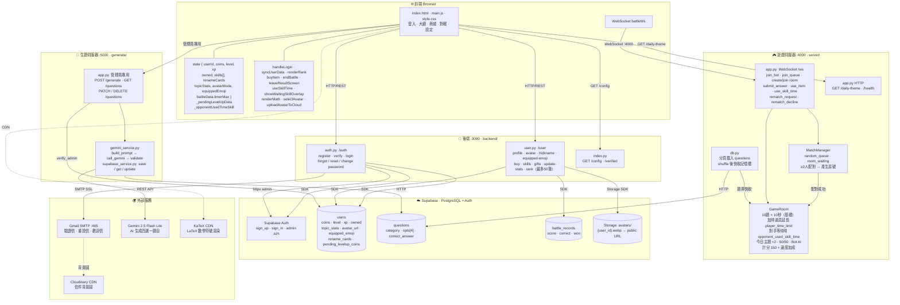

# 🧠 知識王 - Quiz King

## 📋 遊戲介紹

**知識王** 是一款在線實時知識競答遊戲，玩家透過登錄帳戶參與激烈的一對一對戰。遊戲包含 20+ 個知識主題，如科學、歷史、地理、電競、美食等，每場對戰 10 道題目。

**核心特色：**
- 🎮 **實時對戰**：WebSocket 實現毫秒級同步，兩名玩家同時作答
- 💰 **成長系統**：透過勝負獲得金幣、經驗值、升級等級
- 🎁 **禮包系統**：初次登入禮包、每日登入禮包、升等禮包（Popup 顯示前即入帳）
- 🛍️ **裝扮系統**：解鎖頭像框、稱號、特效等獎勵
- 🤖 **AI 練習**：可與 AI 對手進行練習（金幣不獎懲，其餘統計全部計入）
- 📊 **數據統計**：追蹤勝率、準確率、各主題成績、最強主題
- 🏆 **排行榜**：依總分降序，最多顯示 50 筆，自己排名超出時以 ⋮ 標示區段
- 🎯 **對戰技能**：「50/50 消去錯誤選項」、「加時 +10 秒」（庫存制，每次使用消耗一個）
- ➕ **真實加時**：加時道具由後端延長計時器，對手時間到後畫面鎖定並顯示等待提示
- 🎊 **升等動畫**：比賽結束進入結果畫面後，**離開**結果畫面時才播放（再來一場不打斷，累積後再顯示）
- 📐 **數學題支援**：題目與選項支援 LaTeX 數學符號（KaTeX 渲染）

---

## 📁 檔案結構與功能說明

### 🎨 **前端部分（Frontend）**

#### `index.html` - 主頁面
```
功能：定義遊戲的 HTML 結構
主要元素：
- 登入／註冊／忘記密碼介面
- 遊戲大廳（個人數據、排行榜、商城）
- 遊戲對戰介面（題目顯示、選項、計時器、技能按鈕）
- 結算介面（勝負統計、獲得獎勵、再來一場）
- 個人設定（外觀裝備、帳號管理）
- 禮包 Popup（歡迎禮包、每日禮包、升等禮包）
```

#### `main.js` - 客戶端邏輯與業務流程（核心檔案）
```
核心變數：
- state：玩家狀態
  * userId, playerName, customId, email
  * coins, level, xp, xpMax
  * wins, losses, totalAnswered, avgAccuracy, totalScore
  * owned: { frames, tags, effects, skills }
    - skills 為 text[]，允許重複（['skill-5050','skill-5050'] = 2 個）
  * renameCards：改名卡張數（整數）
  * topicStats：各主題答題統計 { category: { correct, wrong } }
  * nicknameRemainingFree：本月剩餘免費改名次數
  * avatarMode：'emoji' | 'image'（目前使用的頭像類型）
  * equippedEmoji：目前裝備的 emoji 頭貼（預設 🧠，與 DB equipped_emoji 同步）
  * customAvatarDataUrl：自訂頭像的 URL 或 base64（image 模式）
  * battleData.timerMax：本題目前時間上限（基礎 10 秒，使用加時道具後更新）

- shopData：商城數據（頭像框、稱號、特效、技能、道具價格）

- _pendingLevelUpData：{ level, base, milestone }
  * 升等資料暫存，不立即播放動畫
  * 跨再來一場累積（base / milestone 相加）
  * 離開結果畫面時才觸發動畫

- _opponentUsedTimeSkill：boolean
  * 對手使用了加時道具的旗標
  * 新題目開始時重置

關鍵函數：
- handleLogin()：處理玩家登入
- handleRegister()：處理玩家註冊
- showScreen(id)：切換介面
- handleRandomMatch()：加入隨機配對佇列
- answerQuestion(chosen, btn)：提交答案
- useSkill50()：使用 50/50 技能（檢查庫存 → 扣一個 → 呼叫 use-skill API → 更新按鈕）
- useSkillTime()：使用加時技能
  * 前端延長 timerMax 並重啟計時器
  * 同時發送 { type: 'use_skill_time' } 給後端，讓後端也延長計時
- resetSkillBtns()：更新技能按鈕狀態與數量顯示（xN badge）
- deductSkill(skillId)：從 state.owned.skills 移除一個並呼叫後端
- startTimer(sec)：啟動題目計時器，設定 bd.timerMax = sec
- updateTimer(val)：更新計時圓圈，以 bd.timerMax 為分母（正確滿格顯示）
- timeOut()：本地計時器歸零時呼叫，送 usedSec = timerMax 給後端
- showWaitingSkillOverlay()：對手使用加時、本方等待時顯示半透明鎖定卡片
- hideWaitingSkillOverlay()：收到 question_result 或新題目時移除鎖定卡片
- buyItem(tab, id)：購買裝扮／道具
- renderShop(tab)：渲染商城（技能顯示「已有 N 個」，改名卡顯示「已有 N 張」）
- confirmRenameCard()：改名（優先免費次數 → 自動消耗改名卡 → 若兩者皆無則顯示錯誤，不扣金幣）
- selectAvatar(emoji)：選擇 emoji 頭貼，同步 state、localStorage、DB
- uploadAvatarToCloud(dataUrl)：裁切後上傳頭像到 Supabase Storage，並更新 DB avatar_url
- renderRank()：渲染排行榜（最多 50 筆，自己排名超出時以 ⋮ 標示）
- checkDailyGift()：每日禮包（API 呼叫成功後才顯示 Popup）
- showWelcomeModal()：歡迎禮包（同上，Popup 前先入帳）
- showLevelUpOverlay(level, base, milestone)：升等動畫（螢幕閃光、爆炸粒子、數字跳動等）
- leaveResultScreen(target)：離開結果畫面，並觸發累積的升等動畫（延遲 500ms 待切換完成）
- showDeclineAndExit(msg)：拒絕再來一場，顯示橫幅後雙方自動退出結果畫面
- autoClaimMissedGifts()：補領未入帳的升等禮包
- endBattle()：對戰結束，呼叫 update-stats 寫入後端並同步 topic_stats
  * 升等時存入 _pendingLevelUpData（累加），不立即播放
- renderMath(el, text)：將文字內容設定到元素並以 KaTeX 渲染 LaTeX 數學符號
- syncUserData()：同步使用者數據
- createStars()：生成背景星空動畫
- updatePlayerBar()：更新頂部玩家欄（等級、金幣、XP）
```

#### `style.css` - 樣式表
```
功能：定義遊戲的視覺設計
包含：
- 星空背景主題（深藍色 #0a0a1a）
- 發光黃金色按鈕（#FFD700）
- 動畫效果（星星閃爍、卡片滑入、答題振動、禮包爆炸）
- 技能按鈕數量 badge（.skill-count）
- 排行榜樣式（.rank-top3、.rank-you 等）
- 升等動畫：全螢幕閃光（.levelup-flash）、爆炸光束（.levelup-burst）、
            彩色碎紙（.levelup-confetti）、衝擊波（.levelup-shockwave）、
            星光粒子（.levelup-sparkle）、數字震動（#levelUpNum.punch）
- 再來一場拒絕橫幅（.decline-banner / .decline-banner-out）
- 加時等待提示卡（.waiting-skill-overlay / .waiting-skill-card）：
  半透明毛玻璃卡片，鎖定對手畫面直到 question_result 到達
- KaTeX 樣式微調（.katex、.katex-display）
- 響應式佈局
```

---

### 🔐 **後端部分（驗證系統）** - `backend/` 資料夾

#### `index.py` - 驗證服務主檔案
```
功能：Flask 應用入口，配置 CORS、路由註冊、環境變數載入

關鍵函數：
- app = Flask(__name__)：建立 Flask 服務實例
- CORS(app)：配置跨域資源共享，允許前端跨域請求
- register_blueprint(auth_bp)：註冊驗證藍圖，路由前綴為 /auth
- register_blueprint(user_bp)：註冊使用者藍圖，路由前綴為 /user
- config()：返回管理員所需的 Gemini/Supabase 配置
- verified()：驗證郵箱後的成功頁面

API 路由：
- GET /config：取得後端配置（僅管理員）
- GET /verified：郵箱驗證成功頁面
```

#### `auth.py` - 驗證與帳戶管理
```
功能：處理註冊、登入、忘記密碼、郵箱驗證、修改密碼、刪除帳號

關鍵函數與 API：

1. send_email(to_email, subject, html_content)
   - 使用 Gmail SMTP 發送郵件

2. POST /auth/register - 使用者註冊
   - 請求：{ custom_id, nickname, email, password }
   - 流程：
     * 檢查 custom_id 是否已存在
     * 密碼長度驗證（至少 6 位）
     * Email 格式驗證
     * 在 Supabase Auth 建立使用者
     * 在 users 表記錄使用者數據（預設等級1、金幣0）
     * 發送驗證郵件，24小時內驗證有效
     * 逾期未驗證則刪除帳戶
   - 響應：{ user_id, message }

3. POST /auth/verify-email - 郵箱驗證
   - 請求：{ token }
   - 流程：解析 token → 更新 is_verified → 發送歡迎郵件
   - 響應：{ message }

4. POST /auth/login - 使用者登入
   - 請求：{ email_or_id, password }
   - 響應：{ access_token, user_id, email }

5. POST /auth/forgot-password - 忘記密碼
   - 生成重置 token（1 小時有效）並發送郵件連結

6. POST /auth/reset-password - 重置密碼
   - 請求：{ token, new_password }

7. POST /auth/change-password - 修改密碼（已登入）
   - 請求：{ user_id, old_password, new_password }

8. DELETE /auth/delete-account - 刪除帳號
   - 請求：{ user_id, password }
```

#### `user.py` - 玩家數據管理
```
功能：取得玩家資訊、修改暱稱、購買道具、對戰結果、禮包、排行榜

關鍵函數與 API：

1. GET /user/profile/<user_id> - 取得玩家資訊
   - 返回：{ id, custom_id, email, coins, nickname, level, xp, wins, losses,
            total_answered, avg_accuracy, total_score, owned_frames, owned_tags,
            owned_effects, owned_skills, active_effect, avatar_url, equipped_emoji,
            topic_stats, nickname_remaining_free, rename_cards, pending_levelup_coins }

2. POST /user/nickname - 修改暱稱
   - 優先順序：免費次數（每月3次）→ 自動消耗 rename_cards → 兩者皆無則回傳 400
   - 響應：{ message, used_rename_card, remaining_free, rename_cards }

3. POST /user/avatar - 上傳自訂頭像
   - 請求：{ user_id, avatar_data: base64 WebP }
   - 響應：{ avatar_url }

4. POST /user/buy-item - 購買裝扮／道具
   - 請求：{ user_id, item_type, item_id, price }
   - 響應：{ remaining_coins, owned } 或 { remaining_coins, rename_cards }

5. POST /user/use-skill - 使用技能（消耗品）
   - 從 owned_skills 移除一個符合的項目
   - 響應：{ remaining: 剩餘數量 }

6. POST /user/equip-item - 裝備物品
   - 響應：{ message }

7. POST /user/update-stats - 對戰結束更新統計
   - 請求：{ user_id, won, score, correct, total, opp_correct, mode, topic_stats }
   - 響應：{ coins, level, xp, xp_max, wins, losses, total_answered,
            avg_accuracy, total_score, topic_stats, leveled_up, coin_delta,
            xp_gain, level_up_base, level_up_milestone }
   - mode='bot' 時：金幣固定為 0，其餘統計（wins / losses / topic_stats 等）照常更新

8. POST /user/welcome-gift - 初次登入禮包
9. POST /user/daily-gift - 每日登入禮包
10. POST /user/levelup-gift - 升等禮包（消耗 pending_levelup_coins）

11. GET /user/rank - 排行榜
    - 參數：user_id（標記自己）
    - 依 total_score 降序，同分比 wins，並列名次相同
    - 最多回傳 50 筆玩家資料
    - 回傳 total（全體玩家數）供前端判斷是否顯示 ⋮
    - 響應：{ rank: [...], myRank: {...}, total: N }

12. POST /user/equipped-emoji - 儲存 emoji 頭貼到 DB

關鍵常數：
- FREE_NICKNAME_CHANGE_LIMIT = 3：每月免費改名次數
```

---

### 🎮 **遊戲伺服器（對戰系統）** - `server/` 資料夾

#### `app.py` - 遊戲服務主檔案
```
功能：WebSocket 伺服器，管理實時對戰連接

關鍵變數：
- PORT = 4000
- match_manager：配對管理器實例
- rooms：所有活躍遊戲房間字典 { room_id: GameRoom }
- pending_rematch：等待再來一局的資料 { room_id: { players, votes } }
- questions：題庫列表

handle_message(ws, msg) 處理的訊息類型：
- 'join_bot'：加入 AI 練習
- 'join_queue'：加入隨機匹配佇列
- 'create_room'：建立房間
- 'join_room'：加入指定房間
- 'cancel_queue'：取消配對
- 'quit_match'：主動退出對戰
- 'submit_answer'：提交答案
- 'use_item'：使用 50/50 道具
- 'use_skill_time'：使用加時道具，轉發給 GameRoom.use_skill_time()
- 'rematch_request'：要求再來一局
- 'rematch_decline'：拒絕再來一局
```

#### `match_manager.py` - 配對管理器
```
功能：管理隨機配對佇列、房間建立與加入

class MatchManager:
    - enqueue_random(ws, on_match)：加入隨機佇列，≥2 人時立即配對
    - create_room(ws, room_id, on_match)：建立等待房間
    - join_room(ws, room_id, on_match)：加入現存房間
    - remove_from_queue(ws)：從佇列移除玩家
```

#### `game_room.py` - 遊戲房間邏輯
```
功能：管理一局兩人對戰的全部流程

常數：
- QUESTION_TIMEOUT = 10：每題基礎回答時間（秒）
- RESULT_DELAY = 1.5：題目結算延遲（秒）
- QUESTIONS_PER_GAME = 10：每局題目數

class GameRoom：
    每題狀態：
    - player_time_limit：[float, float]
      各玩家本題時間上限，基礎 = QUESTION_TIMEOUT
      使用加時道具後對應玩家的上限 +10
    - question_start_time：float，題目發出的 time.time()
    - skill_time_notified：[bool, bool]
      防止重複通知，每題重置

    def start()
        - 發送 'game_start' 訊息給兩位玩家
        - 1.5 秒後呼叫 _send_question()

    def _send_question()
        - 重置 answers、answered、removed_options、player_time_limit、skill_time_notified
        - 記錄 question_start_time
        - 發送題目給兩位玩家
        - 啟動 QUESTION_TIMEOUT 秒計時器
        - 若房間內有 AI，模擬 AI 在 2-8 秒後隨機作答

    def submit_answer(player_id, answer_idx, used_sec)
        - usedSec 夾在 [0, player_time_limit[player_idx]] 內（各玩家各自上限）
        - 通知對方 'opponent_answered'
        - 雙方都答題時，取消計時器並立即結算

    def use_skill_time(player_id)
        - player_time_limit[player_idx] += 10
        - 取消現有計時器，以尚未作答玩家中最早到期時間重排新計時器
        - 注意：不立即通知對手，通知由 _resolve_question 在適當時機發出

    def use_item(player_id, item_name)
        - 處理 'delete_wrong'（50/50）：隨機移除一個錯誤選項
        - 通知玩家 'item_used' 含 removedOptionIdx

    def _resolve_question()
        - 計算 elapsed = time.time() - question_start_time
        - 若有玩家尚未作答且 player_time_limit[i] - elapsed > 0.1：
          * 對已完成（作答或超時）的玩家發送 'opponent_used_skill_time'（各自只通知一次）
          * 重排計時器為最短剩餘時間，等待延時玩家
          * 提前返回，不進行結算
        - 全員完成後正常結算：
          * 計分：基礎 150 + 速度加成（最高 200），今日主題 x2
          * 更新 topic_stats
          * 廣播 'question_result'
          * 1.5 秒後發送下一題或結束遊戲

    def _end_game()
        - 發送 'game_end'（含最終分數、勝者、topicStats）
        - 呼叫 on_end() 回呼

    def handle_disconnect(ws_id)
        - 通知對方玩家已斷線並自動獲勝

    @staticmethod calc_score(used_sec)
        - 基礎 150 + round(50 - used_sec/QUESTION_TIMEOUT * 50)
```

#### `db.py` - 題庫載入
```
功能：從 Supabase 資料庫載入題庫

def load_questions()
    - 分頁查詢 questions 表（每頁 1000 題）
    - 題目格式：{ q, opts[4], ans: 0-3, category }
    - 跳過格式不完整的題目，打亂題庫順序
```

---

### 🤖 **題目生成系統** - `generate/` 資料夾

#### `app.py` - 題目生成服務
```
功能：使用 Google Gemini AI 生成題目，存儲到 Supabase（僅管理員）

API：
- POST /generate：{ categories, count } → 生成並存入 Supabase
- GET /questions：分頁查詢（category / keyword / page）
- PATCH /questions/<id>：編輯題目
- DELETE /questions：批量刪除 { ids: [...] }
```

---

## 🔄 程序執行流程（從玩家登入開始）

### **階段 1：玩家啟動遊戲**

```
用戶打開 index.html
  ↓
main.js 執行初始化：
  - createStars() 生成背景星空效果
  - 檢查 localStorage 中是否有 token
  - 若有則自動跳轉到遊戲大廳；若無則顯示登入介面
```

### **階段 2：玩家登入**

```
用戶輸入 Email/ID 和密碼
  ↓
main.js 呼叫 handleLogin()
  ↓
POST backend:3000/auth/login
  ↓
backend/auth.py 驗證 → 返回 JWT token + user_id
  ↓
main.js 保存 token 到 localStorage，呼叫 syncUserData()
  ↓
GET backend:3000/user/profile/<user_id>
  ↓
backend/user.py 返回玩家資訊（等級、金幣、技能庫存、改名卡、頭像等）
  ↓
顯示遊戲大廳 showScreen('dashboardScreen')
  ↓
禮包檢查（依序）：
  - autoClaimMissedGifts()：補領未入帳的升等禮包
  - showWelcomeModal()：首次登入禮包
  - checkDailyGift()：每日登入禮包
```

### **階段 3：遊戲大廳**

```
用戶可選擇：
- 查看排行榜：renderRank()，最多 50 筆，自己在 50 名外則加 ⋮ 區隔
- 進入商城：購買頭像框、稱號、特效、技能（庫存制）、改名卡
- 個人設定：裝備外觀道具、帳號管理、改名
- 開始對戰：選擇隨機配對、建立房號、加入房號或 AI 練習
```

### **階段 4：匹配階段**

```
用戶點擊「隨機匹配」或「建立房間」
  ↓
main.js 建立 WebSocket 連接到 server:4000/ws
  ↓
server/app.py 分配唯一 ID → 等待客戶端訊息

main.js 發送 join_queue / join_bot / create_room / join_room
  ↓
MatchManager 配對成功 → 建立 GameRoom → room.start()
  ↓
雙方收到 'game_start'（含 opponentName、opponentEmoji）
```

### **階段 5：遊戲進行中**

```
GameRoom._send_question() 發送每題：
  { type: 'question', index, total, question, options, category, isDaily }
  ↓
main.js 接收題目：
  - renderMath() 以 KaTeX 渲染題目與選項中的 LaTeX 符號
  - 啟動倒計時（startTimer(10)，timerMax = 10）
  - 技能按鈕顯示庫存數量

用戶作答或使用技能：

  [選擇選項]
    → 發送 { type: 'submit_answer', answerIdx, usedSec }
    → usedSec = min(bd.timerMax, elapsed)（以各自時間上限為準）

  [使用 50/50]
    → 前端扣一個庫存 → 呼叫 /user/use-skill API
    → 發送 { type: 'use_item', item: 'delete_wrong' }
    → 後端回傳 { type: 'item_used', removedOptionIdx }
    → 前端灰掉該選項

  [使用加時 +10s]
    → 前端：bd.timerVal += 10、bd.timerMax = bd.timerVal（圓圈重置為新滿格）
    → 發送 { type: 'use_skill_time' } 給後端
    → 後端：player_time_limit[i] += 10，重排計時器

  [對手時間到，但我還有加時剩餘]
    → 後端 _resolve_question：偵測到我還有時間 → 重排計時器
    → 發送 'opponent_used_skill_time' 給時間已到的對手
    → 對手前端：顯示半透明等待卡片（.waiting-skill-card）鎖定畫面
    → 等我作答或我的時間到後，雙方同時收到 question_result

後端收到雙方答案（或兩人均超時）：
  → _resolve_question() 結算
  → 廣播 'question_result'
  → 前端移除等待卡片，顯示答題結果
  → 1.5 秒後下一題（重複共 10 題）
```

### **階段 6：遊戲結束**

```
第 10 題結算後，呼叫 _end_game()
  ↓
雙方收到 'game_end' → main.js 呼叫 endBattle()
  ↓
POST /user/update-stats（上報對戰結果）
  ↓
backend/user.py 處理：
  - 更新 wins / losses / total_score / total_answered / avg_accuracy
  - 計算金幣 / XP 獎勵（bot 模式金幣固定為 0）
  - 升等判斷：xp >= xp_max 時 level+1，升等禮包存入 pending_levelup_coins
  - 每升 10 級額外給 400 里程碑金幣
  - 合併 topic_stats
  - 寫入 battle_records
  ↓
後端返回 leveled_up、level_up_base、level_up_milestone 等
  ↓
main.js：
  - 若 leveled_up：累加到 _pendingLevelUpData（不立即播動畫）
    * 再來一場時繼續累積
  - 顯示結果畫面 showScreen('resultScreen')

玩家在結果畫面：
  - 點擊「再來一場」→ 請求再來一局（升等動畫不播，繼續累積）
  - 若對手拒絕再來一場 → 顯示橫幅 → 雙方自動退出結果畫面 → 升等動畫播放

玩家離開結果畫面（點擊返回按鈕）：
  → leaveResultScreen(target)
  → showScreen(target)
  → 若 _pendingLevelUpData 存在：500ms 後播放升等動畫
    （動畫包含：螢幕閃光、爆炸粒子、彩色碎紙、衝擊波、星光、數字跳動）
  → _pendingLevelUpData 清空
```

### **階段 7：遊戲斷線處理**

```
若玩家在對戰中斷線：
  ↓
server/app.py finally 塊：
  - 從 random_queue 移除
  - 呼叫 room.handle_disconnect(ws_id)
  ↓
GameRoom.handle_disconnect()：
  - 通知對方玩家已斷線，對方自動獲勝
  ↓
玩家重新登入後：
  - autoClaimMissedGifts() 補領未入帳的升等禮包
```

---

## 🏗️ 系統架構圖



---

## 📊 數據流總結

| 階段 | 參與者 | 操作 | 數據流 |
|------|--------|------|--------|
| **登入** | Frontend → Backend | 驗證帳號密碼 | Email/PW → JWT Token |
| **加載數據** | Backend → Frontend | 取得玩家資料 | user_id → 完整個人數據 |
| **禮包** | Frontend → Backend | 入帳後顯示 Popup | API 成功 → 顯示動畫 |
| **排行榜** | Frontend → Backend | 取得排名 | user_id → 最多 50 筆 + total |
| **配對** | Frontend ↔ GameServer | 加入佇列 | join_queue → 房間 ID |
| **遊戲進行** | GameServer ↔ Frontend | 題目／答案往返 | 實時 WebSocket 同步 |
| **50/50 技能** | Frontend → Backend + GameServer | 扣庫存＋通知伺服器 | use-skill API + use_item WS |
| **加時技能** | Frontend → GameServer | 延長本題計時 | use_skill_time WS → player_time_limit += 10 |
| **等待對手** | GameServer → Frontend | 對手使用加時時通知 | opponent_used_skill_time → 鎖定畫面 |
| **結算結果** | Frontend → Backend | 上報對戰結果 | update-stats → 個人統計全模式更新；battle_records 僅真人對戰寫入 |
| **升等動畫** | Frontend | 離開結果畫面時播放 | _pendingLevelUpData → showLevelUpOverlay |
| **更新資料** | Backend → Frontend | 保存新數據 | 更新後玩家資訊＋排行榜刷新 |

---

## 🚀 快速啟動指南

### 前置需求
```bash
# Python 3.8+

# 環境變數配置（.env 檔案）
SUPABASE_URL=your_supabase_url
SUPABASE_KEY=your_supabase_key
GEMINI_API_KEY=your_gemini_key
GMAIL_USER=your_gmail@gmail.com
GMAIL_PASS=your_app_password
```

### 啟動服務
```bash
# 1. 驗證服務 (Backend)
cd backend
pip install -r requirements.txt
python index.py  # http://localhost:3000

# 2. 遊戲服務 (Game Server)
cd server
pip install -r requirements.txt
python app.py  # ws://localhost:4000

# 3. 題目生成服務（管理員）
cd generate
pip install -r requirements.txt
python app.py  # http://localhost:5000

# 4. 前端
# 使用 Live Server 或其他 HTTP 服務器
# 訪問 http://localhost:5500/index.html
```

---

## 📝 要點總結

- **三層架構**：前端(HTML/JS/CSS) → 後端(Python/Flask) → 資料庫(Supabase)
- **實時通信**：WebSocket 實現毫秒級對戰同步
- **加時道具真實有效**：前後端同步延長計時，對手螢幕鎖定並顯示等待提示，等雙方都完成才結算
- **升等動畫延遲播放**：結果畫面不打斷，真正離開後才顯示；跨再來一場累積獎勵
- **數學題支援**：KaTeX CDN 渲染 LaTeX，題目選項皆支援
- **排行榜最多 50 筆**：自己超出範圍時加 ⋮ 區隔顯示
- **技能庫存制**：技能以陣列重複項計數，每次使用消耗一個
- **改名兩段式**：免費次數（每月3次）→ 改名卡，兩者皆無則提示購買，不扣金幣
- **自訂頭像**：前端裁切為 WebP → 上傳 Supabase Storage → DB 記錄 avatar_url
- **禮包安全機制**：API 先入帳再顯示 Popup，關閉瀏覽器也不會漏領
- **Bot 模式練習**：與 AI 對戰計入所有統計，金幣不獎懲
- **模組化設計**：驗證、遊戲、題目生成各自獨立服務
